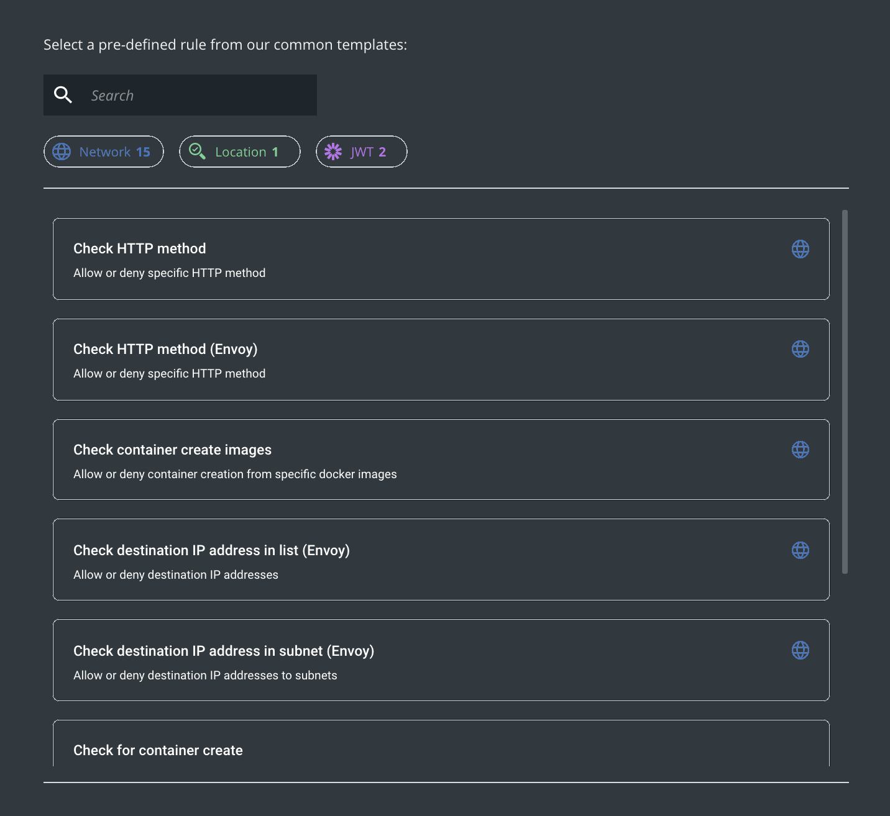

# Predefined Rules \(Templates\)

build.security includes predefined rules that are commonly used in authorization management. These rules are created and customized per integration for you and can easily and quickly be added to your authorization policies.

### Start with Best Practice Rules

To see a list of the predefined rules for an integration, you can create a policy for that integration and enable the option to **Start with best practice rules \(recommended\)**.

With this option enabled, the New Policy Panel will appear when you click Save. The predefined rules for the integration you selected will be listed on this panel.

You can then select the predefined rules that best expresses the policy item you would like to add. Once this is added to the policy items table, you can add additional predefined rules \(or empty rules or custom blocks\) to further define your policy.

Each time you add a policy item to the policy, it will immediately appear in the policy items table, expanded and ready for you to complete any required data. For example, you might want to deny access based on an IP address. The predefined rule will express this need, but it requires you to specify which IP addresses you wish to block.

In addition to the information readily available in the policy item table, the expanded view offers additional details relevant to the policy item.

Although the contents of this expanded section can vary, you can expect to see:

* Specify whether you want the rule to be an **Allow** or **Deny** rule.
* Description of the rule will already be provided, but you can edit it as needed
* Additional field \(optional and customized for the specific policy item. For example, for most of the integrations, a rule such as the Check HTTP method rule will have a field for HTTP method; for Docker integrations, another field might appear.
* Rego code, which displays the syntax of the Rego code for this policy item

