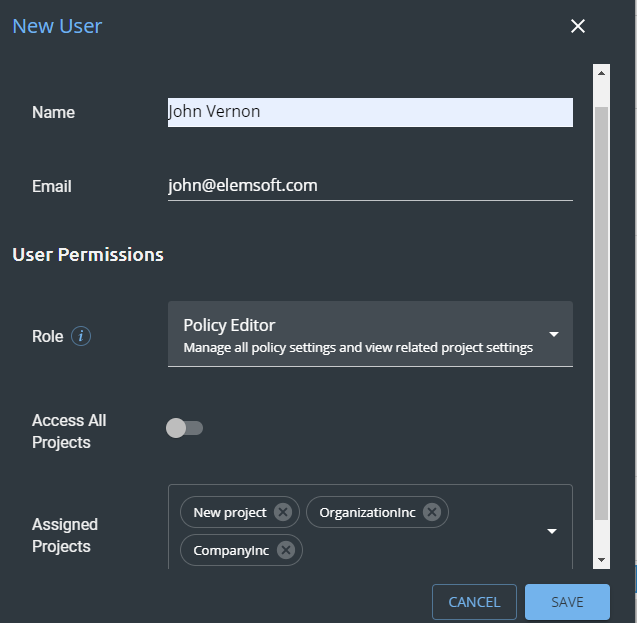

# Managing Users

The user management screen enables the system admin to control all aspects of the user lifecycle within the build.security platform. The user management screen displays a table of all existing users with the following details:

* Name of user
* Email
* Role
* Creation date
* Last login
* Last update
* Actions

In the Actions column, you can click the pencil icon to edit the following details for a user: name, email, whether SSO login is required, the password, and user permissions such as role and whether the user should have access to all projects.

Beside the edit icon, you can click the three vertical dots \(kebab icon\) to access the delete user option.

In the last row of the Users table, you can configure whether you want to see 20, 50, or 100 users at a time. To the right of this option, you can see how many users are currently displayed \(out of how many existing users\) and use the directional arrows to navigate to forward or previous display.

The last row of the table displays a summary of the In the lower right corner of the table are the table details information including how many rows there are in the table and how many are currently being displayed. You can press the down arrow to access additional users currently not displayed.

Below this information, you can click the **+ New** button to open the new user panel, enabling you to add new users.

### Adding a User

**To add a new user:**

1. On the user management screen, click the **+ New** button. The new user panel opens.
2. In the user details section:
   * Enter the user's name in the **Name** field, as it should appear within the system.
   * Enter the user's email address in the **User Email** field. This email address will be used to send the user login information. Note that each user email must be unique to the system. No two users can share the same email.
   * In the **Require SSO** field, you can enable SSO, Note that if you do this, the password field is no longer relevant for this user.
   * In the **Password** field \(assuming **Require SSO** is not enabled\), you can enter a new password for the user. When creating the password, it must contain a combination of at least one number, one capital letter, one lower case letter, and one special character.
3. In the user permissions section:
   * Set the new user's permission level by selecting one of the roles in the list. For more information, see [build.security Roles](roles.md).
   * Select the projects in which this user can fulfill the selected role in the **Apply In** field. You can enable the user to have **Access to All Projects** \(the default option\), or disable this option to select specific projects. Use the down arrow to access a list of currently defined projects. Each time you select a project, it is added to the list in the **Projects** field. To remove a project, click the **X** beside the project's name.
4. Click **Save** to create the new user.

After you create the new user, an email will be sent to the specified email address. This email will include a link to the build.security platform [login page](../../logging-in/logging-in-1.md). For users that are not required to log in with SSO, when they log in the first time, they will be required to change the password.

### Editing a User

**To edit an existing user:**

1. On the user management screen, find the user you wish to edit. If the user is not on the current page, you can use the down arrow below the table to access additional users.
2. In the **Actions** column of the user's row, click the **Edit icon** \(the pencil\). The edit user panel opens with the currently defined user name and email address for the selected user. Note that the password field is empty. Within this panel, you can now make any of the following changes:
   * In the **Name** and **User Email** fields, you can change the current credentials.
   * In the **Require SSO** field, you can enable SSO. Note that if you do this, the password field is no longer relevant for this user.
   * In the **Password** field \(assuming Require SSO is not enabled\), you can enter a new password for the user.
   * In the User Permissions section, you can define \(or change\) the user's current **role** by selecting one of the available options and select the relevant projects for this user. See[ build.security roles](roles.md) for more information.
3. When you have completed your changes, click **Save** to save and apply your changes.

### Deleting a User

**To delete a user:**

1. Locate the user you wish to delete. You can use the down arrow to access additional users if you do not immediately find the user you wish to delete in the currently displayed list.
2. Beside the edit icon \(a pencil\), click the three vertical dots \(kebab icon\) to access the delete user option.
3. Click **Delete**.
4. Click **Confirm** to confirm that you wish to delete the selected user. The user will be deleted.

