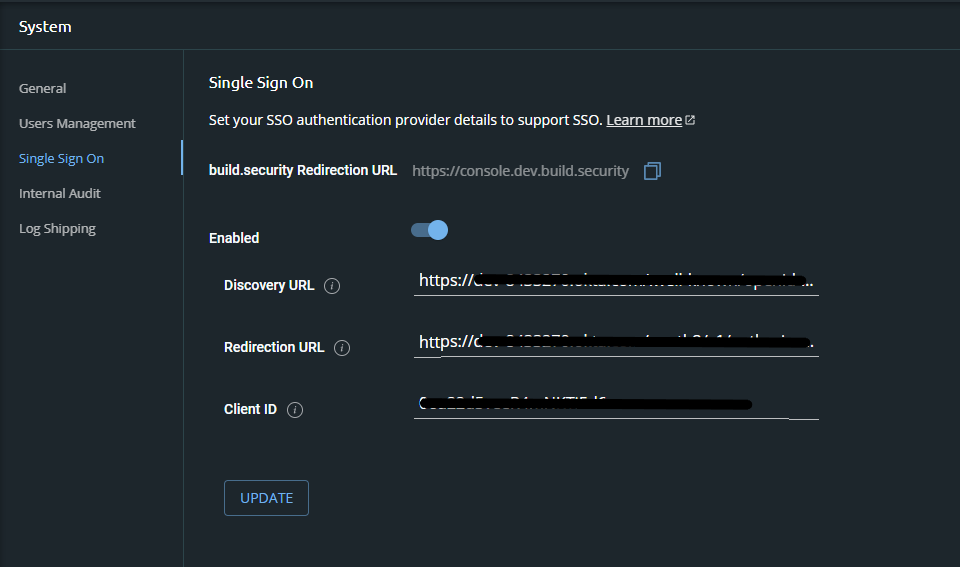

# Single Sign On

If you are not familiar with Single Sign On, we recommend that you review [https://auth0.com/docs/sso](https://auth0.com/docs/sso).

Explained simply, SSO allows our customers to manage their users and appropriate roles in one place, across all of their vendors.

This guide uses the field names as they are displayed in Okta. Field names may vary over different identity providers, but most likely will be similar to the ones that appear below.


**Note**

Currently, we support only the OpenID Connect protocol for Single Sign-On. If you use other protocol \(e.g. SAML\), please contact [support@build.security](mailto:support@build.security)


To define an identity provider, select the **System Settings** option located at the bottom of the navigation panel. In the system screen, select **Single Sign On**.

### Defining build.security in your chosen Identity Provider

In Okta, you will create a new application, that will connect with build.security.

* If your identity provider lets you choose application type, choose `Single Page App (SPA)`
* If your identity provider lets you choose `allowed grant types,`choose `Authorization Code`, `implicit`, `Allow ID Token with implicit grant type`

* Please copy the `build.security Redirection URL` field and paste it in your identity provider, under `Login redirect URIs`.  This is the URL that your identity provider will use to redirect your users  after a successful authentication, so your identity provider must know this specific URL in advance.

* Copy the Client ID from your identity provider and paste it in build.security's control plane.

In Okta, you will find these fields under the application that you want to connect with build.security.

### Redirection URL

Your identity provider should supply an `Authorize URL`. You should complete the URL as follows:

* `response type` - id\_token
* `response mode` - fragment
* `scope` - `openid` `email` `profile`
* `redirect uri` - &lt;hostname of build.security&gt; \(eg. https://console.poc.build.security\)

  Paste that URL in build.security under `Redirection URL`

* `state` - **Remove** the state from the redirection URL! build.security will generate this field. 

### Discovery URL

Also known as well-known URL, the Discovery URL helps build.security verify the authentication process against your identity provider. Some identity providers supply this URL for all customers under the same template. 

For example, in Okta, the URL is: `https://<YOUR_DOMAIN>.okta.com/.well-known/openid-configuration`

