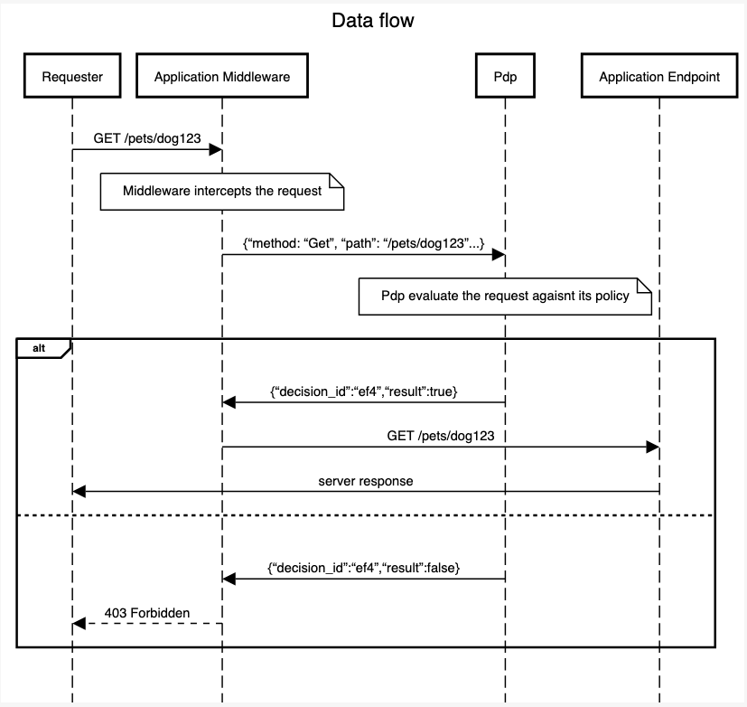

# Middleware Integration

To ease your integration with build.security, we've created a list of out-of-the-box middlewares. Each of these middlewares will allow you to perform authorizing requests against your PDP.   
If you don't find the middleware that suits your ecosystem, please [contact us](https://build.security/contact-us/).

#### Available Middlewares

* .Net - [https://github.com/build-security/OPA-AspDotNetCore-Middleware](https://github.com/build-security/OPA-AspDotNetCore-Middleware)
* Node.js - [https://github.com/build-security/opa-express-middleware](https://github.com/build-security/opa-express-middleware)
* Java - [https://github.com/build-security/opa-java-client](https://github.com/build-security/opa-java-client)
* Spring - [https://github.com/build-security/opa-java-spring-client](https://github.com/build-security/opa-java-spring-client)
* PHP - [https://github.com/build-security/opa-symfony-middleware](https://github.com/build-security/opa-symfony-middleware)
* Python - [https://github.com/build-security/opa-python-client](https://github.com/build-security/opa-python-client)

#### How does it work?

First, make sure you have a policy defined in the system. These policy rules are used to assess each client request to your system. For every client request to your service/resource, a middleware will pre-assess if the client\user is authorized to access this endpoints/resource.

The client request will be first evaluated against your PDP, and will continue to the relevant endpoint only if the PDP decided to allow it. Otherwise, the request will be rejected with an 403 FORBIDDEN http response.

This functionality can be achieved easily and requires no maintenance and almost no code changes. Most of the middlewares would only require you to add a decorator\attribute in your relevant endpoints code.

#### 

