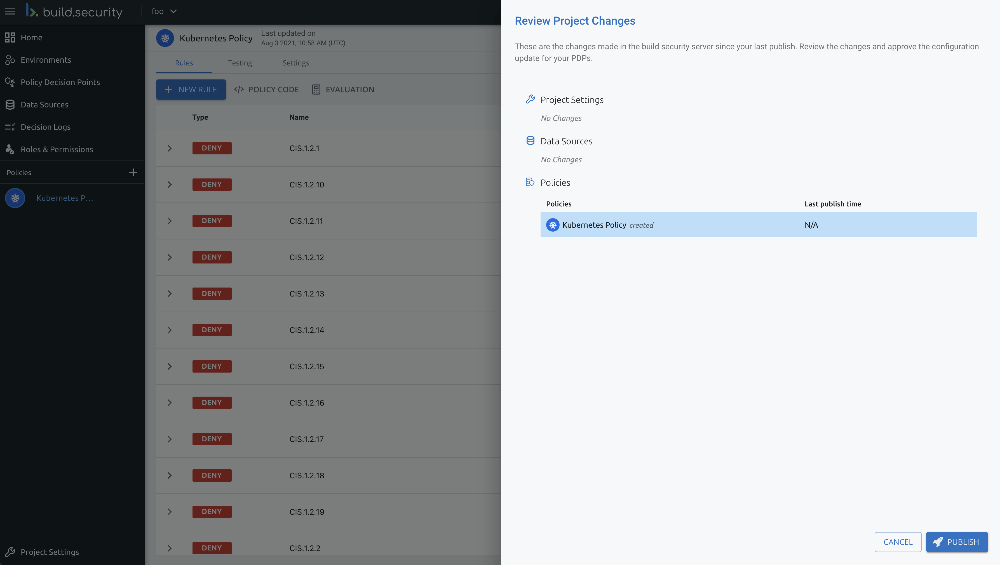
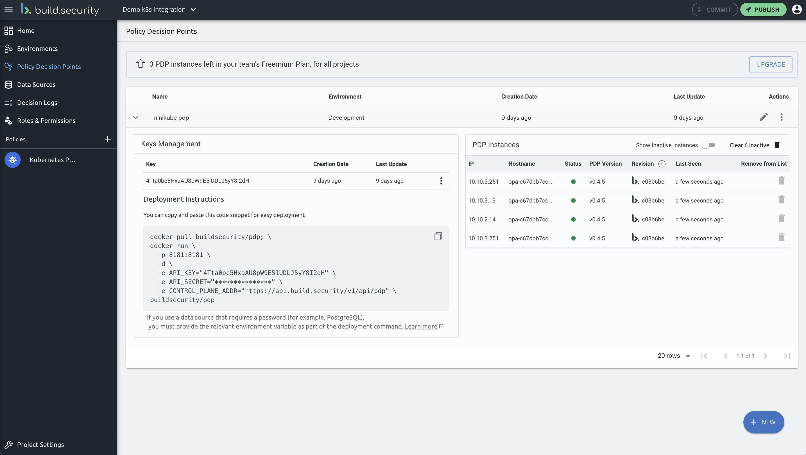
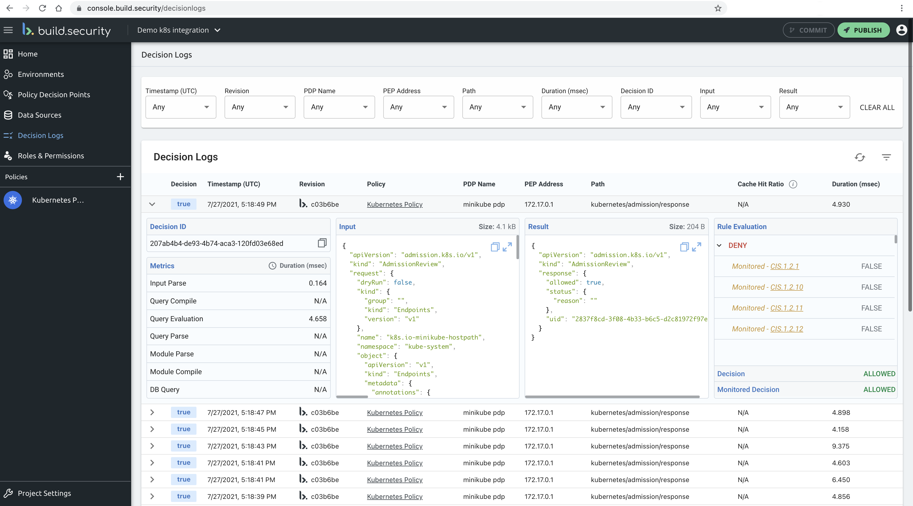
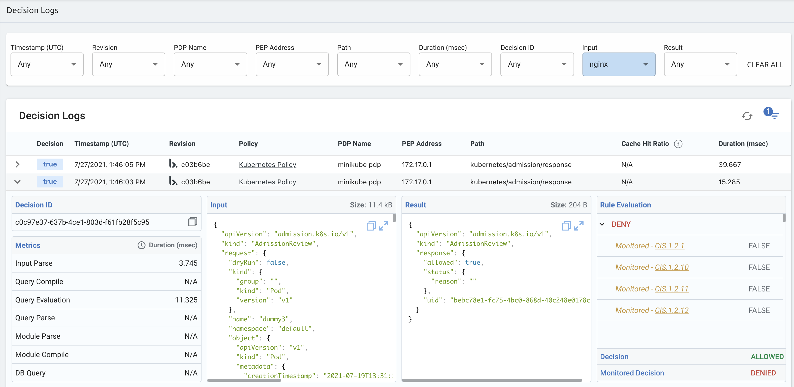
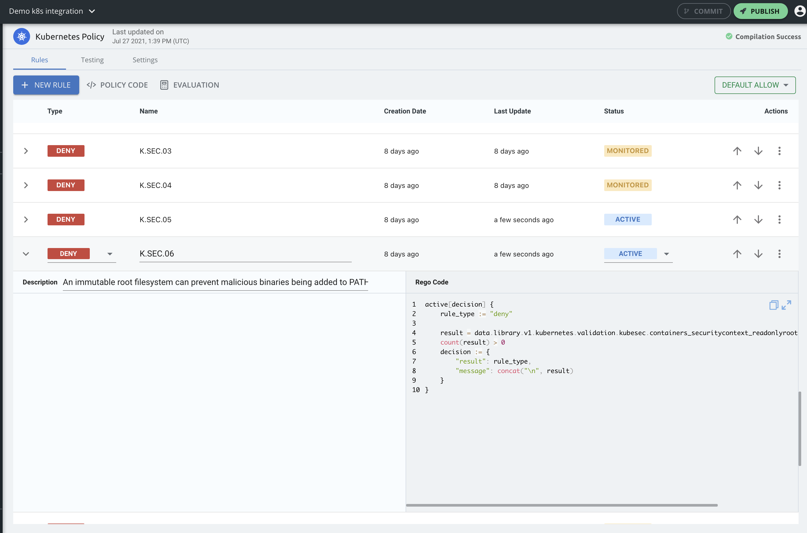
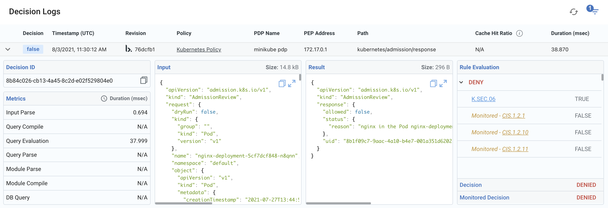

# Kubernetes Admission Control Integration

## Introduction

In the following guide we will focus on integrating build.security's PDP as a validating admission controller. Using the PDP will allow you to enjoy the [control plane's](https://console.build.security/) rich capabilities on top of OPA.  

**What is a Kubernetes admission controller?**

> In a nutshell, Kubernetes admission controllers are plugins that govern and enforce how the cluster is used. They can be thought of as a gatekeeper that intercept \(authenticated\) API requests and may change the request object or deny the request altogether. The admission control process has two phases: the _mutating_ phase is executed first, followed by the _validating_ phase. Consequently, admission controllers can act as mutating or validating controllers or as a combination of both.

source: [https://kubernetes.io/blog/2019/03/21/a-guide-to-kubernetes-admission-controllers/](https://kubernetes.io/blog/2019/03/21/a-guide-to-kubernetes-admission-controllers/)

## Prerequisites

This tutorial requires Kubernetes 1.13 or later. To run the tutorial locally ensure you start a cluster with Kubernetes version 1.13+, we recommend using [minikube](https://kubernetes.io/docs/getting-started-guides/minikube) or [KIND](https://kind.sigs.k8s.io/).

Start minikube:

```
$ minikube start
```


To use admission control rules that validate Kubernetes resources during create, update, and delete operations, you must enable the [ValidatingAdmissionWebhook](https://kubernetes.io/docs/reference/access-authn-authz/admission-controllers/#validatingadmissionwebhook) when the Kubernetes API server is started. The ValidatingAdmissionWebhook admission controller is included in the [recommended set of admission controllers to enable](https://kubernetes.io/docs/admin/admission-controllers/#is-there-a-recommended-set-of-admission-controllers-to-use)


## Steps

#### 1. Create a PDP using the control plane  <a id="4-define-a-policy-and-load-it-into-opa-via-kubernetes"></a>

If you are not familiar with how to create a PDP follow this [guide](https://docs.build.security/documentation/policy-decision-points-pdp/creating-a-new-pdp-configuration), then [generate an api key and secret](https://docs.build.security/documentation/policy-decision-points-pdp/generating-api-keys-for-a-pdp).

#### 2. Create a Kubernetes policy and publish it to a PDP <a id="4-define-a-policy-and-load-it-into-opa-via-kubernetes"></a>

[Create a new policy in the control plane](https://docs.build.security/documentation/policies/creating-a-new-policy). Make sure you pick Kubernetes integration.


Notice that the default policy comes with a set of rules that are all set as Monitored. By default we set the policy to allow all requests, so at first we won't enforce any of the rules.

Now let's publish the new policy so it would be served to the PDP once it is deployed.



#### 3. Create a new Namespace to deploy PDP into <a id="1-start-kubernetes-recommended-admisson-controllers-enabled"></a>

When PDP is deployed on top of Kubernetes, policies are automatically loaded whenever you publish a policy using the control plane.

```text
kubectl create namespace buildsecurity
```

Configure `kubectl` to use this namespace:

```text
kubectl config set-context pdp-tutorial --user minikube --cluster minikube --namespace buildsecurity
kubectl config use-context pdp-tutorial
```

#### 4. Deploy PDP on top of Kubernetes <a id="3-deploy-opa-on-top-of-kubernetes"></a>

Communication between Kubernetes and PDP must be secured using TLS. To configure TLS, use `openssl` to create a certificate authority \(CA\) and certificate/key pair for PDP:

```text
openssl genrsa -out ca.key 2048
openssl req -x509 -new -nodes -key ca.key -days 100000 -out ca.crt -subj "/CN=admission_ca"
```

Generate the TLS key and certificate for PDP:

```text
cat >server.conf <<EOF
[req]
req_extensions = v3_req
distinguished_name = req_distinguished_name
prompt = no
[req_distinguished_name]
CN = pdp.buildsecurity.svc
[ v3_req ]
basicConstraints = CA:FALSE
keyUsage = nonRepudiation, digitalSignature, keyEncipherment
extendedKeyUsage = clientAuth, serverAuth
subjectAltName = @alt_names
[alt_names]
DNS.1 = pdp.buildsecurity.svc
EOF
```

```text
openssl genrsa -out server.key 2048
openssl req -new -key server.key -out server.csr -config server.conf
openssl x509 -req -in server.csr -CA ca.crt -CAkey ca.key -CAcreateserial -out server.crt -days 100000 -extensions v3_req -extfile server.conf
```

> Note: the Common Name value and Subject Alternative Name you give to openssl MUST match the name of the PDP service created below.

Create a Secret to store the TLS credentials for PDP:

```text
kubectl create secret tls pdp-server --cert=server.crt --key=server.key
```

Next, use the file below to deploy PDP as an admission controller.


Pay attention to fill your own PDP api key and api secret \(Lines 44 & 46 admission-controller.yaml\)


**`admission-controller.yaml`**:

```text
kind: Service
apiVersion: v1
metadata:
  name: pdp
  namespace: buildsecurity
spec:
  selector:
    app: pdp
  ports:
  - name: https
    protocol: TCP
    port: 443
    targetPort: 8181
    
---

apiVersion: apps/v1
kind: Deployment
metadata:
  labels:
    app: pdp
  namespace: buildsecurity
  name: pdp
spec:
  replicas: 1
  selector:
    matchLabels:
      app: pdp
  template:
    metadata:
      labels:
        app: pdp
      name: pdp
    spec:
      containers:
        - name: pdp
          image: buildsecurity/pdp:latest
          imagePullPolicy: Always
          args:
            - "--tls-cert-file=/certs/tls.crt"
            - "--tls-private-key-file=/certs/tls.key"
          env:
            - name: API_KEY
              value: "YOUR API KEY HERE"
            - name: API_SECRET
              value: "YOUR API SECRET HERE"
            - name: CONTROL_PLANE_ADDR
              value: "https://api.build.security/v1/api/pdp"
          volumeMounts:
            - readOnly: true
              mountPath: /certs
              name: pdp-server
          readinessProbe:
            httpGet:
              path: /health?plugins&bundle
              scheme: HTTPS
              port: 8181
            initialDelaySeconds: 10
            periodSeconds: 5
          livenessProbe:
            httpGet:
              path: /health
              scheme: HTTPS
              port: 8181
            initialDelaySeconds: 10
            periodSeconds: 5
      volumes:
        - name: pdp-server
          secret:
            secretName: pdp-server
```

And run the following:

```text
kubectl apply -f admission-controller.yaml
```

You can now check that the PDP is online in the control plane.



#### 5. Register PDP as an admission controller:

Generate the manifest that will be used to register PDP as an admission controller. This webhook will ignore any namespace with the label `build.security/webhook=ignore`.

```text
cat > webhook-configuration.yaml <<EOF
kind: ValidatingWebhookConfiguration
apiVersion: admissionregistration.k8s.io/v1
metadata:
  name: pdp-validating-webhook
webhooks:
  - name: validating-webhook.build.security
    namespaceSelector:
      matchExpressions:
      - key: build.security/webhook
        operator: NotIn
        values:
        - ignore
    rules:
      - operations: ["CREATE", "UPDATE"]
        apiGroups: ["*"]
        apiVersions: ["*"]
        resources: ["*"]
    sideEffects: None
    failurePolicy: Ignore # Change to Fail - to strict on webhook failure and fail the action
    clientConfig:
      caBundle: $(cat ca.crt | base64 | tr -d '\n')
      service:
        namespace: buildsecurity
        name: pdp
        path: /v0/data-ex/kubernetes/admission/response
    admissionReviewVersions: ["v1", "v1beta1"]
    timeoutSeconds: 5
EOF
```

The generated configuration file includes a base64 encoded representation of the CA certificate so that TLS connections can be established between the Kubernetes API server and PDP.

Next label `kube-system` and the `buildsecurity` namespace so that PDP does not control the resources in those namespaces.

```text
kubectl label ns kube-system build.security/webhook=ignore
kubectl label ns buildsecurity build.security/webhook=ignore
```

Finally, register the PDP as an admission controller:

```text
kubectl apply -f webhook-configuration.yaml
```

You can follow the PDP logs to see the webhook requests being issued by the Kubernetes API server:

```text
# ctrl-c to exit
kubectl logs -l app=pdp -c pdp -f
```

#### 6. Check your control plane

Go to Decision Logs to see the requests being made and being sent to the control plane properly:



#### 7. Exercise the policy <a id="5-exercise-the-policy"></a>

`nginx.yaml`

```text
apiVersion: apps/v1
kind: Deployment
metadata:
  name: nginx-deployment
spec:
  selector:
    matchLabels:
      app: nginx
  replicas: 1
  template:
    metadata:
      labels:
        app: nginx
    spec:
      containers:
      - name: nginx
        image: nginx:latest
        resources:
          requests:
            memory: 64Mi
            cpu: 250m
        ports:
        - containerPort: 80
```

Now lets create the nginx and see the results:

```text
kubectl create -f nginx.yaml -n default
```

Use Decision Logs filters to find the relevant events to nginx:



Now let's change some of the rules that could have denied the request and publish our changes




Now, let’s try and recreate nginx. Remember that we expect this operation to fail since the relevant rule is now active

```text
kubectl delete -f nginx.yaml -n default
kubectl create -f nginx.yaml -n default

# Error from server (nginx in the Deployment nginx-deployment is not using a read only root filesystem): error when creating "nginx.yaml": admission webhook "validating-webhook.build.security" denied the request: nginx in the Deployment nginx-deployment is not using a read only root filesystem
```

And in the Decision Logs you would see the following:




