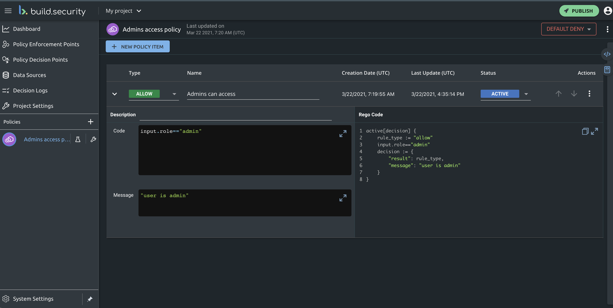

# Policy unit testing

## Introduction

The policy evaluation panel enables you to perform a dry-run of an authorization request on an active Policy Decision Point point at any time during policy authoring.

Using this feature you can reduce the policy authoring working time and approve your policy is tested according to your needs.

The simplicity of testing in one click aside of the policy rules will help understand each change you do on the policy immediately.

**So let's get started...**


The evaluation calculation is done on an active real PDP instance you can [verify](doc:policy-decision-points) that you have an active instance, if not simply [deploy](doc:pdp-implementation) a new Decision point.


## Our Policy

We will use a simple basic policy which DENYs access by default and ALLOWs access to requests where `input.role == "admin"`

## Policy tests example 

We will create 3 tests 

1. a
2. b
3. c

By clicking ....

Upon the policy behivor changes - for example, the default behavior of the policy we set above changes to ALLOW

 The next time that we will run the tests, we will get this resolution


**Coming soon** 

\*\*\*\*



**Congratulations**

You are ready to start writing tests.

If you will need more information - feel free to contact us on our [support portal ](https://build-security.atlassian.net/servicedesk/customer/portals)


